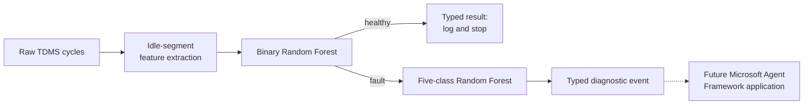

# Bearing Ring Condition Monitoring

A reproducible reference implementation of the two-stage Random Forest diagnostic pipeline described
by Ahmer et al. (2022) for a bearing-ring grinding machine.

The implemented component turns high-frequency grinding-cycle measurements into a typed diagnostic
result:

1. a binary Random Forest detects whether a fault is present;
2. when a fault is detected, a second Random Forest identifies one of five known failure modes;
3. a local API emits probabilities, model provenance, and a deterministic signal for downstream
   analysis.

The model is intentionally separate from the planned orchestration layer. A future Microsoft Agent
Framework application can consume the API result for maintenance reasoning and human approval
without receiving raw sensor arrays or depending on model-training code.

## Project status

| Capability | Status |
|---|---|
| Complete 735-ring data validation | Implemented |
| Idle-segment signal feature extraction | Implemented |
| Binary and five-class Random Forest training | Implemented |
| PyTorch-loadable forest artifact | Implemented |
| CLI and FastAPI inference | Implemented |
| HTTPYac API contract tests | Implemented |
| Slidev demonstration | Implemented |
| Microsoft Agent Framework application | Planned |
| Azure deployment with `azd` | Planned |

This is a research reproduction and reference architecture, not a certified machine-safety or
production-control system.

## System boundary



Only the deterministic path through the typed diagnostic event is implemented today. The future
agent application will reason over model output, maintenance context, sensor costs, and business
constraints; it will not reinterpret the raw waveforms.

## Dataset and fault classes

The full research dataset contains 735 grinding cycles:

- 7 machine-condition tests;
- 7 grinding-wheel dressing cycles per test;
- 15 bearing rings per dressing cycle;
- 13 analogue channels sampled at 100 kHz;
- process parameters for every ring.

Tests 1 and 7 are healthy baselines. Tests 2 through 6 represent:

1. workhead drive-belt damage;
2. workhead spindle unbalance;
3. drive-plate setup fault;
4. workhead tooling setup fault;
5. worn workhead tooling support.

The raw dataset is intentionally not committed to this repository. With no configuration, the
source root is repository-relative:

```text
./data/source
```

Expected structure:

```text
data/source/
  test_1.zip
  ...
  test_7.zip
  test_1/test_1/dresscyc_1/ring_1.tdms
  ...
  test_7/test_7/dresscyc_7/ring_15.tdms
  proc_param/proc_param/process_data.csv
  quality/quality/measured_quality_param.csv
  quality/quality/quality_disposition.csv
```

`--data-root` on `data-check.sh` or `build-features.sh` always has highest
precedence. For mise tasks, mise loads `GRINDER_DIAGNOSTICS_DATA_ROOT` from the
repository-root `.env`; without a configured value, the code uses
`./data/source`.

For an external dataset, copy `.env.example` to `.env` and set the absolute path:

```bash
cp .env.example .env
```

`mise.toml` uses mise's `env._.file` directive to load `.env`. The Python
settings layer also loads `.env` as a fallback for direct execution without
mise. In that direct-execution mode, an existing process environment value
takes precedence over `.env`. `.env` and `data/source/` are ignored by Git.

## Reproduction results

The implementation extracts 160 candidate features from the pre-contact idle segment, selects 58,
and trains 30-tree forests.

| Evaluation split | Binary accuracy | Five-class accuracy |
|---|---:|---:|
| Paper-like stratified 70/30 | 98.64% | 100.00% |
| Dressing-cycle grouped | 99.05% | 98.00% |

The publication reports binary F1 of 99.54% and global five-class F1 of 99.68%. This repository is a
close Python reconstruction rather than an exact MATLAB port: the paper does not publish every
filter cutoff, segmentation threshold, NCA setting, or random seed. Both the paper-like split and a
more conservative dressing-cycle-grouped split are reported to make leakage risk visible.

The exported PyTorch forests match the corresponding scikit-learn probabilities exactly on the
complete verification set (`0.0` maximum observed probability delta).

See [model results and usage](docs/model/02-running-and-results.md) for confusion matrices, reduced
sensor experiments, artifact descriptions, and limitations.

## Quick start

### Prerequisites

- Linux or WSL
- [`mise`](https://mise.jdx.dev/)
- access to the published dataset

`mise` pins Python, `uv`, Node.js, and pnpm. Python environments and packages are managed only
through `mise` and `uv`; system Python is not modified.

### Set up and validate

```bash
mise run a:setup
mise run b:model:data:check
mise run k:verify
```

### Build features and train

```bash
mise run c:model:features:build
mise run d:model:train
```

Generated files are written to:

```text
data/generated/grinder-diagnostics-model/
artifacts/grinder-diagnostics-model/
```

The primary inference artifact is `artifacts/grinder-diagnostics-model/model.pt`.

### Run local inference

Command line:

```bash
mise run e:model:predict
```

API:

```bash
mise run f:api:serve
```

The service exposes:

| Method | Endpoint | Purpose |
|---|---|---|
| `GET` | `/health` | Readiness and loaded model version |
| `GET` | `/v1/model` | Feature schema, labels, and threshold |
| `POST` | `/v1/predict` | Two-stage fault prediction |

Send a generated sample request:

```bash
mise run g:api:sample
```

Run the HTTPYac contract suite while the API is running:

```bash
mise run l:http:setup
mise run m:http:test
```

The response includes `downstream_analysis_required`, allowing a later agent workflow to branch on
the deterministic model decision.

## Demo

Install and launch the Slidev presentation:

```bash
mise run h:demo:setup
mise run i:demo:serve
```

The deck includes presenter notes and a live CLI/API walkthrough. See the
[demo guide](docs/demo/00-slidev-demo.md).

## Repository structure

| Segment | Location | Purpose |
|---|---|---|
| Trained diagnostics model | `src/grinder_diagnostics_model/` | Data validation, features, training, export, inference, API |
| Model operations | `scripts/model/` | Reproducible command wrappers |
| Model tests | `tests/model/` | Python unit and API tests |
| HTTP contract tests | `tests/http/` | HTTPYac success and failure scenarios |
| Model documentation | `docs/model/` | Data, reproduction plan, results, and operation |
| System architecture | `docs/architecture/` | Complete workflow proposal and model-to-agent contract |
| Demonstration | `demos/grinder-diagnostics/` | Slidev presentation |
| Agent application | `apps/maintenance-agent/` | Reserved for Microsoft Agent Framework |
| Azure infrastructure | `infra/azure/` | Reserved for future `azd` deployment |

Start with the [documentation index](docs/README.md).

## Reproducibility notes

- Raw inputs remain read-only; processing does not create another full raw-data copy.
- Feature generation processes one TDMS ring at a time and can resume from partial output.
- Split manifests preserve the exact rings used for evaluation.
- Feature selection is fit only on training data for reported evaluation results.
- The production artifact is retrained on all 735 rings after evaluation.
- Model metadata records feature order, class labels, training configuration, data hash, and
  implementation hash.
- Generated model fixtures cover healthy operation and all five known fault classes.

## Citation and attribution

This work reproduces and adapts the methodology from:

> Ahmer, M., Sandin, F., Marklund, P., Gustafsson, M., & Berglund, K. (2022). Failure mode
> classification for condition-based maintenance in a bearing ring grinding machine. *The
> International Journal of Advanced Manufacturing Technology, 122*, 1479–1495.
> <https://doi.org/10.1007/s00170-022-09930-6>

The source paper is open access under the
[Creative Commons Attribution 4.0 International License](https://creativecommons.org/licenses/by/4.0/).
Figures, reported reference metrics, and methodological descriptions derived from the paper must
retain attribution.

The accompanying research dataset is cited by the paper as:

> Ahmer, M., Sandin, F., Marklund, P., Gustafsson, M., & Berglund, K. (2022). *Dataset concerning
> the process monitoring and condition monitoring data of a bearing ring grinder*. Luleå University
> of Technology. <http://urn.kb.se/resolve?urn=urn:nbn:se:ltu:diva-92569>

When publishing results produced with this repository, cite both the paper and the dataset and
clearly distinguish the paper's reported metrics from this implementation's reproduction results.

### BibTeX

```bibtex
@article{ahmer2022failure,
  author  = {Ahmer, Muhammad and Sandin, Fredrik and Marklund, Pär and
             Gustafsson, Martin and Berglund, Kim},
  title   = {Failure mode classification for condition-based maintenance
             in a bearing ring grinding machine},
  journal = {The International Journal of Advanced Manufacturing Technology},
  year    = {2022},
  volume  = {122},
  pages   = {1479--1495},
  doi     = {10.1007/s00170-022-09930-6}
}

@misc{ahmer2022dataset,
  author    = {Ahmer, Muhammad and Sandin, Fredrik and Marklund, Pär and
               Gustafsson, Martin and Berglund, Kim},
  title     = {Dataset concerning the process monitoring and condition
               monitoring data of a bearing ring grinder},
  publisher = {Luleå University of Technology},
  year      = {2022},
  url       = {http://urn.kb.se/resolve?urn=urn:nbn:se:ltu:diva-92569}
}
```
