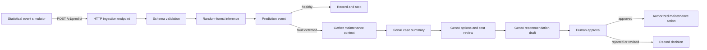
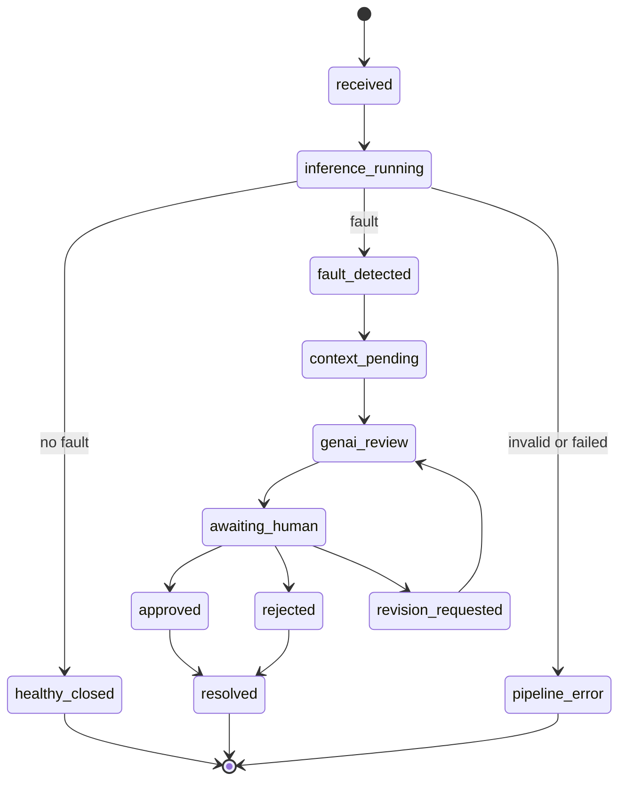
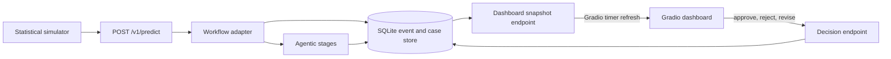
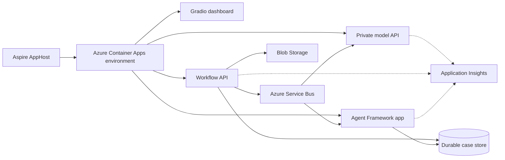

# 01 - Proposed GenAI-assisted maintenance workflow

## Purpose

This document proposes an implementation in which generative AI assists with the manual work that
follows a deterministic machine diagnosis.

The random-forest pipeline remains responsible for signal processing and fault classification.
The proposed GenAI layer would gather supporting records, summarize the case, compare maintenance
and sensor options, and prepare a recommendation for human review.

The separation is intentional:

- deterministic code processes measurements and produces the diagnosis;
- GenAI organizes the engineering and business context around that diagnosis;
- authorized personnel approve maintenance, procurement, or configuration changes.

Raw sensor data does not enter the GenAI context. The model API converts the selected features into
a small, typed prediction result before any GenAI-assisted workflow begins.

## Proposed workflow



The GenAI-assisted portion begins only after the classifier returns a valid result. It does not
replace feature extraction, execute the model, or reinterpret the source waveform.

## Initial HTTP ingestion decision

The first implementation will use the existing synchronous HTTP model endpoint:

```text
POST /v1/predict
```

The caller supplies a request identifier and all 58 production features. The endpoint validates the
exact feature schema, runs the PyTorch-exported random forests, and returns the typed prediction.

```json
{
  "request_id": "sim-workhead-drive-belt-damage-000042",
  "features": {
    "<each production feature name>": 0.0
  }
}
```

The abbreviated object above represents the request shape; an actual request must contain every
feature reported by `GET /v1/model` and no additional features.

For the initial local implementation, the HTTP caller acts as both simulator and workflow adapter:

1. Generate one statistically valid feature vector.
2. Submit it to `POST /v1/predict`.
3. Preserve the complete response as an immutable prediction event.
4. Stop processing when `downstream_analysis_required` is `false`.
5. Send fault events through context gathering and the proposed GenAI-assisted stages.
6. Stop at the human approval gate before any state-changing action.

Industrial event brokers, durable queues, and scheduled ingestion remain future deployment options.
They are not required to establish the local contract.

## Raw-data observations that shape the simulator

The simulator is based on statistics calculated from the supplied data, not on generated narratives
or an LLM. The inspected source contains:

- 735 TDMS ring files: 7 tests, 7 dressing cycles per test, and 15 rings per cycle;
- 13 analogue channels sampled at 100 kHz and 2 digital channels sampled at 10 kHz;
- 735 process-data rows and 186 selectively measured quality rows;
- 160 extracted candidate features, of which the production model requires 58;
- 210 baseline observations from Tests 1 and 7;
- 105 observations for each of the five fault conditions.

A representative ring contains 930,014 analogue samples per channel and 93,000 digital samples per
channel. Feature extraction uses the pre-contact idle segment identified by the `AE_limit` digital
transition. The observed idle duration differs materially by condition:

| Condition | Rows | Minimum seconds | Median seconds | Maximum seconds |
|---|---:|---:|---:|---:|
| Baseline | 210 | 0.9153 | 1.0952 | 1.2629 |
| Workhead drive-belt damage | 105 | 0.8245 | 0.9934 | 1.0965 |
| Workhead spindle unbalance | 105 | 1.0057 | 1.1030 | 1.1931 |
| Drive-plate setup fault | 105 | 0.9550 | 1.1246 | 1.2344 |
| Workhead tooling setup fault | 105 | 1.0774 | 1.4034 | 1.9107 |
| Worn workhead tooling support | 105 | 1.8891 | 2.1735 | 2.2611 |

All 58 selected features are finite and non-constant within every condition. Their distributions are
not well represented by independent normal variables:

- median absolute within-condition skewness is 0.492;
- the 90th percentile of absolute skewness is 1.624;
- the maximum observed absolute skewness is 11.345;
- median absolute within-condition feature correlation is 0.188;
- the 90th percentile of absolute correlation is 0.672;
- some feature pairs are perfectly correlated by construction.

For example, the extractor defines band power as mean square and RMS as its square root. Sampling
those fields independently could create internally inconsistent events. The experimental class
counts are also balanced by design, so they do not estimate real production fault prevalence.

The process and quality tables can later supply scenario context, but they are excluded from the
first simulator request because they are not inputs to the current model endpoint.

## Statistics-only event simulator

### Goals

The first simulator should:

- emit the exact 58-feature schema accepted by the model API;
- produce baseline and named-fault scenarios from empirical distributions;
- preserve marginal shape, cross-feature dependence, and known feature constraints;
- support a deterministic seed for repeatable demonstrations and tests;
- identify every event as simulated;
- avoid introducing a neural generator or LLM into model-input creation.

### Proposed statistical method

Use a **class-conditional Gaussian copula with shrinkage covariance**. This is preferable to an
independent normal model because it accommodates skewed marginal distributions while retaining
cross-feature dependence.

Fit one generator for baseline and one for each fault condition:

1. Select the 58 production features from the derived ring-feature table.
2. Group rows by `condition`.
3. For each feature within a condition, calculate its empirical cumulative distribution.
4. Convert feature ranks to latent normal scores using the inverse standard-normal CDF.
5. Estimate the latent correlation matrix with Ledoit-Wolf shrinkage. Shrinkage is required because
   each fault class has only 105 rows for 58 features.
6. Draw a latent multivariate-normal sample using a seeded random-number generator.
7. Convert each latent value back through the empirical quantile function for that condition.
8. Project the result onto known feature constraints:
   - finite values only;
   - non-negative standard deviation, RMS, peak-to-peak, crest factor, and band power;
   - `band_power = rms²` when both fields are present for the same sensor and domain;
   - values contained within the observed class support or an explicitly configured robust bound.
9. Reject samples that are too distant from the observed class in latent Mahalanobis distance or
   that are unrealistically close to an original row.
10. Attach simulator provenance outside the model feature dictionary.

For feature \(j\) in condition \(c\), the transformation is:

```text
u(i,j) = empirical_rank(x(i,j)) / (n(c) + 1)
z(i,j) = inverse_normal_cdf(u(i,j))
z*     ~ multivariate_normal(0, shrinkage_correlation(c))
x*(j) = empirical_quantile(c, j, normal_cdf(z*(j)))
```

This is a statistical simulator of the model's feature space. It is not a reconstruction of a raw
100 kHz waveform and must not be presented as one.

### Scenario selection

The simulator should accept:

| Parameter | Meaning |
|---|---|
| `condition` | Baseline or one of the five known fault conditions |
| `count` | Number of cycle events to emit |
| `seed` | Reproducible random seed |
| `interval` | Optional delay between HTTP requests |
| `scenario_id` | Identifier shared by all events in one run |

The default demonstration should use an explicit round-robin or caller-supplied condition mix. It
must not derive production prevalence from the balanced research dataset.

Two operating modes are useful:

| Mode | Behavior | Purpose |
|---|---|---|
| `statistical` | Sample from the fitted class-conditional copula | Primary simulated-event mode |
| `replay` | Submit an unchanged observed feature row with provenance | Model and HTTP smoke testing |

Replay events must be labeled as empirical replay. Statistical events must include the generator
version, fit-data hash, condition, seed, and sample sequence number in the workflow event metadata.
Only the 58 numeric features are sent in the API's `features` object.

### Statistical validation before use

The generator should be accepted only after a held-out validation by dressing cycle:

1. Fit on complete dressing-cycle groups rather than random individual rows.
2. Compare generated and held-out marginals using medians, interquartile ranges, tail quantiles, and
   two-sample Kolmogorov-Smirnov statistics.
3. Compare generated and held-out Spearman correlation matrices.
4. Confirm all algebraic and range constraints.
5. Measure nearest-neighbor distance to detect memorized rows.
6. Submit generated events to the model and report classification agreement with the requested
   scenario as a validation metric, not as a generation target.
7. Record the generator configuration, selected-feature schema, source-table hash, and random seed.

The model must not be used to repeatedly tune samples until a desired prediction appears. That would
turn the simulator into an adversarial model-output generator rather than a statistical
representation of the observed condition.

### Bias risks and controls

The simulator provenance metadata cannot bias model predictions because it is kept outside the 58
input features. The simulated feature distribution can nevertheless introduce evaluation bias by:

- reproducing the research dataset's artificial class balance;
- generating overly typical or easy examples;
- smoothing rare events and distribution tails;
- evaluating on rows used to fit the simulator;
- rejecting samples based on whether the model returns the desired prediction.

Mitigations are:

- use the simulator for pipeline and workflow testing, not as evidence of production model accuracy;
- separate simulator fitting and validation by complete dressing-cycle groups;
- define scenario frequencies explicitly rather than treating dataset frequencies as production
  prevalence;
- validate marginals, tails, correlations, and prediction-score distributions against held-out real
  data;
- report validation by condition rather than relying on aggregate accuracy;
- never filter or tune generated samples using model output;
- test multiple seeds together with deliberate boundary and outlier scenarios;
- validate final conclusions against real production events before operational use.

## Prediction event and pipeline handoff

The synchronous HTTP response becomes a CloudEvents-compatible `diagnostics.prediction.v1` workflow
event. This event preserves model output and adds transport metadata without modifying the
prediction:

```json
{
  "specversion": "1.0",
  "type": "diagnostics.prediction.v1",
  "source": "local/statistical-event-simulator",
  "id": "0f5d0a83-2c3d-4af7-a92e-4de6a74f3934",
  "time": "2026-08-26T20:00:00Z",
  "subject": "grinder-01/cycle/sim-000042",
  "datacontenttype": "application/json",
  "data": {
    "simulation": {
      "scenario_id": "belt-damage-demo",
      "condition": "workhead_drive_belt_damage",
      "method": "gaussian_copula_ledoit_wolf",
      "generator_version": "stats-v1",
      "seed": 20260826,
      "sequence": 42,
      "fit_data_sha256": "<sha256>"
    },
    "prediction": {
      "request_id": "sim-workhead-drive-belt-damage-000042",
      "model_version": "rf-<version>",
      "has_fault": true,
      "binary_probability": 0.997,
      "fault_type": "workhead_drive_belt_damage",
      "fault_probabilities": {
        "workhead_drive_belt_damage": 0.968
      },
      "downstream_analysis_required": true,
      "warnings": [],
      "provenance": {
        "feature_table_sha256": "<sha256>"
      }
    }
  }
}
```

The event tail is:

```text
HTTP model response
  -> immutable prediction event
  -> deterministic healthy/fault routing
  -> governed maintenance-context retrieval
  -> GenAI case summary
  -> GenAI maintenance and sensor-option comparison
  -> GenAI recommendation draft with evidence and assumptions
  -> human approve, reject, or request revision
  -> authorized executor only after approval
```

Each stage consumes and emits typed state. The generated text is advisory; the unchanged prediction,
retrieved evidence, and approval record remain separately available for audit.

## Model response contract

The current API returns a typed response suitable for downstream orchestration:

```json
{
  "request_id": "cycle-2026-08-26-0042",
  "model_version": "rf-<version>",
  "has_fault": true,
  "binary_probability": 0.997,
  "binary_probabilities": {
    "normal": 0.003,
    "fault": 0.997
  },
  "fault_type": "workhead_drive_belt_damage",
  "fault_probabilities": {
    "workhead_drive_belt_damage": 0.968,
    "workhead_spindle_unbalance": 0.014,
    "drive_plate_setup_fault": 0.009,
    "workhead_tooling_setup_fault": 0.006,
    "worn_workhead_tooling_support": 0.003
  },
  "downstream_analysis_required": true,
  "warnings": [],
  "provenance": {
    "model_artifact": "<configured-model-path>",
    "feature_table_sha256": "<sha256>"
  }
}
```

Random forests produce class-vote proportions or class probabilities. These values should not be
presented as statistical certainty. The API therefore uses `binary_probability` and
`fault_probabilities` rather than an unqualified `confidence` field.

The routing policy remains deterministic:

```text
has_fault = false
    -> persist the healthy result
    -> no GenAI review

has_fault = true
and downstream_analysis_required = true
    -> persist the fault result
    -> assemble the maintenance context
    -> start GenAI-assisted review

schema validation or inference failure
    -> record an operational error
    -> route to technical support rather than producing a recommendation
```

## Manual work proposed for GenAI assistance

The proposed GenAI implementation targets work that an engineer or maintenance planner would
otherwise perform manually after receiving a fault result:

1. Retrieve maintenance history, equipment configuration, open work orders, and relevant guidance.
2. Convert the model response and retrieved records into a concise diagnostic case summary.
3. Compare available sensor configurations, installation costs, and known diagnostic limitations.
4. Identify missing, conflicting, or stale information that requires human attention.
5. Draft maintenance and instrumentation options with supporting evidence.
6. Prepare an approval request for the responsible engineer or maintenance owner.

### Demo scope: minimal synthetic operational context

The local demonstration will require fake maintenance and business data because the research dataset
contains machine measurements and quality observations, not a CMMS, asset registry, sensor catalog,
procurement system, or approval directory.

The goal is to demonstrate the plumbing across the model, context retrieval, GenAI stages, and human
approval. It is not necessary to simulate every fault condition or every possible enterprise data
source.

The first demo should use one primary scenario: `drive_plate_setup_fault`. It is sufficient to show:

- a model-generated fault event;
- an installed sensor configuration with a documented diagnostic weakness;
- a short synthetic maintenance history;
- one synthetic open inspection work order;
- two sensor or maintenance options with different costs;
- one intentionally missing or stale fact that the GenAI stage must flag;
- a draft recommendation that requires explicit human approval.

`workhead_drive_belt_damage` can be added as a second fixture only if a simpler mechanical
maintenance example is needed. The remaining fault conditions do not need operational-context
fixtures for the first demonstration.

The lowest-effort implementation is a small set of versioned JSON files:

```text
apps/maintenance-agent/fixtures/demo/
  manifest.json
  assets/grinder-01.json
  maintenance/grinder-01.json
  work-orders/grinder-01.json
  guidance/fault-actions.json
  sensors/catalog.json
  approvals/policy.json
```

The proposed fixtures are:

| Fixture | Minimal synthetic content | Manual step demonstrated |
|---|---|---|
| `manifest.json` | Fixture version, scenario ID, `synthetic: true`, and creation notes | Provenance and clear separation from production data |
| `assets/grinder-01.json` | Asset ID, model, location alias, and installed sensors | Equipment configuration retrieval |
| `maintenance/grinder-01.json` | Two or three dated inspection and repair records | Maintenance-history retrieval and summarization |
| `work-orders/grinder-01.json` | One open inspection order with status and priority | Open-work identification |
| `guidance/fault-actions.json` | Short approved action list for the selected fault | Evidence-grounded diagnostic summary |
| `sensors/catalog.json` | Two configurations, costs, lead times, and known limitations | Option and cost comparison |
| `approvals/policy.json` | Synthetic approver role and permitted decisions | Human approval routing |

No service emulator is needed initially. A local fixture-retrieval tool can read these files through
typed interfaces shaped like future CMMS, asset, catalog, and approval adapters. Replacing a fixture
reader with a real connector should not change the GenAI workflow contract.

The six manual activities map to the demo as follows:

1. **Retrieve context:** read the local fixture files rather than calling enterprise systems.
2. **Summarize the case:** combine the immutable prediction with the small maintenance and asset
   fixture set.
3. **Compare options:** evaluate only the two fixture-backed options in `sensors/catalog.json`.
4. **Flag data quality:** identify the deliberately stale or missing fixture field without inventing
   a replacement value.
5. **Draft a recommendation:** cite the fixture IDs and model prediction used for each claim.
6. **Request approval:** write a pending approval record for a human to approve, reject, or revise;
   do not create a real work order or purchase request.

Every fixture and derived event must carry `synthetic: true` or an equivalent provenance marker.
Synthetic operational records must not be presented as facts from the research paper, the source
dataset, or a real maintenance system.

The first demo explicitly excludes:

- live CMMS, ERP, procurement, historian, or identity integrations;
- fake histories for all five fault classes;
- a complete sensor-product catalog;
- automated work-order creation or procurement;
- claims that generated business context validates model accuracy.

The GenAI layer is not authorized to:

- alter the model prediction or probability values;
- infer directly from raw vibration, force, or acoustic waveforms;
- conceal missing information or manufacture supporting evidence;
- approve purchases, change machine settings, or create executable work orders without authorization;
- describe model probabilities as guaranteed outcomes.

## Context supplied to the GenAI workflow

The model result is combined with governed engineering and business data before review:

- model and feature-schema versions;
- detected fault and class probabilities;
- model warnings and provenance;
- equipment identity and installed sensor configuration;
- relevant maintenance history and approved maintenance guidance;
- sensor purchase, installation, and operating costs;
- known weaknesses of reduced sensor configurations;
- budget, downtime, and operational constraints.

An orchestration envelope could use the following structure:

```json
{
  "demo": {
    "synthetic_context": true,
    "fixture_set": "drive-plate-demo-v1"
  },
  "prediction": {
    "request_id": "cycle-2026-08-26-0042",
    "model_version": "rf-<version>",
    "has_fault": true,
    "fault_type": "drive_plate_setup_fault",
    "fault_probabilities": {
      "drive_plate_setup_fault": 0.968
    },
    "warnings": []
  },
  "asset": {
    "asset_id": "grinder-01",
    "installed_sensor_set": "condition_monitoring_only"
  },
  "configuration_options": [
    {
      "name": "selected_combined_set",
      "multiclass_accuracy": 0.9968,
      "installation_cost": 12500,
      "known_weaknesses": []
    },
    {
      "name": "condition_monitoring_only",
      "multiclass_accuracy": 0.969,
      "installation_cost": 7200,
      "known_weaknesses": ["drive_plate_setup_fault"]
    }
  ],
  "constraints": {
    "available_budget": 8000,
    "approval_required": true
  }
}
```

## Proposed GenAI responsibilities

A Microsoft Agent Framework application could divide the review into bounded responsibilities:

| Responsibility | Proposed behavior |
|---|---|
| Case preparation | Retrieve approved records and create a traceable summary of the fault event |
| Diagnostic context | Explain the detected fault using maintenance guidance and model metadata |
| Cost and planning | Compare instrumentation and maintenance options against stated constraints |
| Recommendation synthesis | Present options, trade-offs, assumptions, and unresolved questions |
| Approval preparation | Route the draft to an authorized person without executing the action |

Separate responsibilities make the source of each claim easier to trace. They are not intended to
create an unconstrained debate or to substitute generated reasoning for the model output.

## Proposed live operations dashboard

The local demonstration should include a dashboard that makes the complete event path visible. It
should show simulated cycles arriving in real time, distinguish healthy results from detected faults
and pipeline errors, expose the agentic workflow queue, and retain the human decision and resolution
for each fault case.

Use the model's terms **healthy** and **fault detected** rather than only **pass** and **fail**. This
avoids confusing machine-condition classification with product-quality acceptance. A separate
**pipeline error** state covers invalid requests and processing failures.

### Minimum dashboard views

| View | Information shown |
|---|---|
| Live event stream | Arrival time, request ID, scenario, healthy/fault/error result, fault type, top probability, and current workflow stage |
| Status summary | Total events, healthy count, fault count, pipeline errors, event rate, and pending approvals |
| Fault scenarios | Counts and recent cases by fault type, including synthetic scenario provenance |
| Workflow queue | Cases waiting for context, GenAI review, human approval, revision, or resolution |
| Case detail | Immutable model response, fixture sources, generated summary, options, assumptions, and citations |
| Resolutions | Approved, rejected, revised, and resolved cases with timestamps and decision notes |

The dashboard is operational visibility for the demonstration. It must not present simulated event
rates, fault frequencies, or resolution times as production metrics.

### Workflow state model

Every cycle and fault case should have a typed state rather than a status inferred from generated
text:



The queue is the set of cases in `context_pending`, `genai_review`, `awaiting_human`, or
`revision_requested`. The dashboard should display stage age so stalled work is visible.

### Streaming event contract

The workflow should publish small dashboard events whenever durable state changes:

| Event type | Trigger |
|---|---|
| `cycle.received.v1` | HTTP ingestion accepts a request |
| `prediction.completed.v1` | Model inference returns healthy or fault detected |
| `prediction.failed.v1` | Validation or inference fails |
| `workflow.stage.changed.v1` | A case enters a new deterministic or GenAI stage |
| `approval.requested.v1` | A recommendation is ready for human review |
| `approval.decided.v1` | A human approves, rejects, or requests revision |
| `case.resolved.v1` | The demonstration case reaches its terminal state |

Each dashboard event should contain an event ID, case ID, event time, event type, previous and new
state, and synthetic provenance where applicable. Detailed generated text remains in the case record
and does not need to be copied into every stream message.

### Low-effort local implementation

**Gradio is the preferred dashboard framework for the first implementation.** It keeps the model,
workflow adapter, simulator controls, tables, plots, case details, and approval actions in Python
without requiring a separate frontend build.

The proposed local stack is:

- **Gradio Blocks** for the browser dashboard under `apps/maintenance-agent/dashboard/`;
- **FastAPI** for model, workflow, case, and decision endpoints;
- **SQLite** for events, cases, stage transitions, and approval decisions;
- a Gradio timer callback that refreshes the dashboard snapshot every one or two seconds;
- ordinary HTTP `POST` requests for approve, reject, and revise decisions.

The timer-based refresh is sufficient to demonstrate streaming behavior at local event rates and is
easier to implement than a dedicated push channel. Server-Sent Events can be added later if event
volume or latency requirements make polling inadequate.

Gradio can be mounted on the workflow FastAPI application or run as a separate local process. Even
when mounted, dashboard callbacks should use the same typed service or HTTP contracts as other
clients rather than reading model internals directly.

**Streamlit is a reasonable alternative** if rapid chart composition becomes more important than
action-oriented workflow controls. Its rerun-oriented execution model is less convenient for
long-lived queue state and approval actions, so Gradio is preferred for this demonstration.

Proposed local endpoints:

```text
POST /v1/simulations/run
GET  /v1/dashboard/snapshot
GET  /v1/cases
GET  /v1/cases/{case_id}
POST /v1/cases/{case_id}/decision
```

The Gradio timer calls `GET /v1/dashboard/snapshot` for counters, recent events, and queue state. The
event simulator can call the existing model endpoint directly or be started through
`POST /v1/simulations/run`.



The human decision changes workflow state but does not directly execute maintenance. An approved
case can produce a structured proposed action for a future authorized executor.

### Aspire deployment path

**Aspire is the preferred path for local orchestration, publishing, and Azure deployment.** The
AppHost becomes the source of truth for application services, Azure resources, references,
configuration, health checks, and deployment steps. `azd` is not required as the primary application
deployment CLI.

The repository's `mise.toml` should eventually declare:

```toml
aspire = "latest"
```

The Aspire CLI is intentionally allowed to track its latest stable release. Reproducible model and
application dependencies remain locked separately.

The expected repository structure is:

```text
aspire/
  GrinderDiagnostics.AppHost/
    GrinderDiagnostics.AppHost.csproj
    AppHost.cs
infra/azure/
  custom/
    # Bicep used only where the Aspire resource model needs an extension
```

A C# or TypeScript AppHost can orchestrate the Python services. A C# AppHost is preferred if extensive
Azure infrastructure customization is required because it provides the strongest typed
`Azure.Provisioning` surface.

The intended lifecycle is:

```bash
aspire run
aspire deploy --environment Development
aspire publish --environment Production --output-path ./aspire-output
aspire deploy --environment Production
aspire do <step> --environment Production
```

- `aspire run` starts the local distributed application.
- `aspire deploy` resolves parameters, provisions supported resources, builds and pushes images, and
  applies the target deployment.
- `aspire publish` emits deployment artifacts for review or application by another controlled stage.
- `aspire do <step>` runs a named deployment step and its dependencies.

The AppHost must add an Azure deployment target such as an Azure Container Apps environment.
Otherwise, `aspire publish` or `aspire deploy` can complete without doing useful work because no
resource contributed the corresponding pipeline steps.

Official references:

- [Deploy with Aspire](https://aspire.dev/deployment/deploy-with-aspire/)
- [Deploy to Azure](https://aspire.dev/deployment/azure/)
- [Configure Azure Container Apps](https://aspire.dev/integrations/cloud/azure/configure-container-apps/)
- [Aspire Python integration](https://aspire.dev/integrations/frameworks/python/)

#### Container-first application mapping

The application workloads in this proposal can all be packaged as Azure Container Apps:

| Local component | Aspire resource | Initial Azure target |
|---|---|---|
| PyTorch FastAPI model API | Python Uvicorn app or explicit container | Private Azure Container App |
| Microsoft Agent Framework workflow | Python app or explicit container | Private Azure Container App |
| Gradio dashboard | Python app or explicit container | Azure Container App with authenticated ingress |
| Statistical simulator | Python executable, worker, or explicit container | Internal Container App or deployment-only demo process |
| In-process workflow dispatch | Azure Service Bus resource | Service Bus topics and subscriptions |
| SQLite event and case store | Repository-backed database resource | Managed Azure database selected from measured access patterns |
| Local fixture files | App resource or storage reference | Image-bundled fixtures initially; Blob Storage later |
| Local telemetry | OpenTelemetry resource wiring | Application Insights and Log Analytics |
| Local identities and configuration | AppHost references and parameters | Managed identities and Key Vault references |

Aspire's official Python integration can model scripts, modules, executables, and Uvicorn applications
as local processes. For Azure Container Apps deployment, those workloads become container images.
The model API, workflow service, Gradio dashboard, and simulator therefore do not need a separate
non-container production hosting model.

Managed Azure services such as Service Bus, Blob Storage, Key Vault, and a database are not packaged
as containers. The AppHost models them as Azure resources and connects the application containers by
reference and managed identity.

SQLite is explicitly a local demonstration dependency. Workflow code should access events, cases,
stage transitions, and decisions through repository interfaces so an Azure database adapter can
replace SQLite without changing the dashboard or agentic stages.

The model API should have internal ingress in Azure. Only the workflow API and authenticated
dashboard require user-facing routes. Service-to-service calls should use managed identity rather
than shared secrets.



The first Azure deployment can retain the Gradio timer-based snapshot refresh. If polling becomes
inefficient across multiple instances, the dashboard event interface can move to Azure Web PubSub or
Azure SignalR Service without changing the persisted workflow event types.

#### Gaps and safeguards

Aspire significantly reduces deployment plumbing, but it does not remove every infrastructure and
release-management concern:

| Gap | Effect | Proposed response |
|---|---|---|
| Target-specific deployment coverage | A resource without publish or deploy pipeline steps may be ignored or produce only an artifact | Keep application compute on the supported Azure Container Apps target; inspect `aspire publish` output and `aspire deploy --list-steps` |
| Azure authentication and administration | Local `aspire deploy` uses an Azure credential source and Aspire is not a general Azure administration shell | Use Azure CLI or workload identity for authentication and retain `az` only for diagnostics or administrative operations, not routine application deployment |
| Non-container executables | Local processes do not automatically imply a supported production target | Package every application workload as a tested ACA image or add a supported Aspire compute integration |
| Generated Python images | Automatically generated Dockerfiles may not satisfy the managed Python feed, `uv.lock`, direct PyTorch index, native libraries, or artifact-copy requirements | Use explicit reviewed Dockerfiles for the model, workflow, and dashboard until generated images are proven equivalent |
| Managed or specialized compute | A future managed Foundry-hosted agent or unsupported Azure compute type may lack a direct Aspire deployment resource | Keep the first Agent Framework app in ACA; use custom Bicep, `ConfigureInfrastructure`, or an external deployment stage for unsupported targets |
| Enterprise infrastructure | Shared networks, private DNS, policy-controlled resources, cross-subscription resources, and organization naming may exceed defaults | Use `AsExisting`, typed `ConfigureInfrastructure`, infrastructure resolvers, or custom Bicep referenced by the AppHost |
| Environment teardown | The Aspire publish/deploy workflow does not provide the same explicit environment-removal contract previously expected from `azd down` | Keep resources environment-scoped and define a reviewed cleanup runbook or custom pipeline step before creating disposable cloud environments |
| CI/CD approvals and promotion | Aspire defines application deployment steps but does not replace release governance | Let GitHub Actions or Azure DevOps own approvals, credentials, artifact retention, and promotion; invoke Aspire CLI inside those stages |
| Deployment maturity | Aspire CLI and deployment integrations are evolving quickly | Track `latest`, inspect generated Bicep, test in a disposable development subscription, and require review before production deployment |

For a resource that cannot deploy directly, `aspire publish` remains the handoff boundary. The
generated artifacts can be reviewed and applied by an external deployment stage without duplicating
the application topology in ad hoc scripts.

Aspire also supports Azure Functions as a first-class resource and can deploy supported functions to
Azure Container Apps with KEDA scaling. That remains an option for a future event-triggered adapter,
but it is unnecessary for the first implementation because the simulator, HTTP workflow, model,
dashboard, and agent stages can all use the same ACA container model.

The Aspire deployment should provision or reference:

- Azure Container Registry and the application container apps;
- Service Bus topics, subscriptions, and dead-letter handling;
- durable case storage and Blob Storage;
- managed identities and least-privilege role assignments;
- Key Vault only for values that cannot use managed identity;
- Log Analytics, Application Insights, dashboards, and alerts;
- authenticated dashboard ingress and private model ingress.

The local-to-Azure rule is that no workflow state required for correctness may exist only in process
memory. The HTTP schemas, prediction event contract, workflow states, fixture provenance, and human
approval record remain unchanged across environments.

### Suggested dashboard layout

The first screen should favor clarity over a full observability platform:

1. A top summary row for event rate, healthy, faults, errors, and pending approvals.
2. A live event table with the newest cycle first.
3. A fault-scenario chart grouped by the five known model labels.
4. A workflow queue grouped by current state and age.
5. A resolution panel showing human decisions and completed cases.
6. A case drawer that exposes prediction, synthetic fixtures, GenAI output, and audit history.

The dashboard can start with one synthetic fault scenario and healthy events. It does not require
every condition, a production message broker, or connections to real maintenance systems to
demonstrate the end-to-end plumbing.

## Expected output

The proposed workflow should produce a review package containing:

- the unchanged model prediction;
- a concise maintenance case summary;
- relevant records and citations;
- feasible response options and their trade-offs;
- missing information and explicit assumptions;
- a recommended next step;
- the required human approver and approval status.

Any state-changing integration should consume only an approved, structured action—not free-form
generated text.

## Architectural principle

The random forest produces a prediction result. The proposed GenAI layer handles the manual
translation of that result into an evidence-backed maintenance decision package. Human owners retain
authority over the resulting action.
