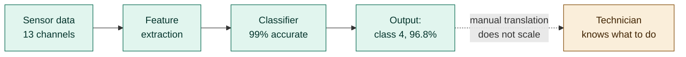
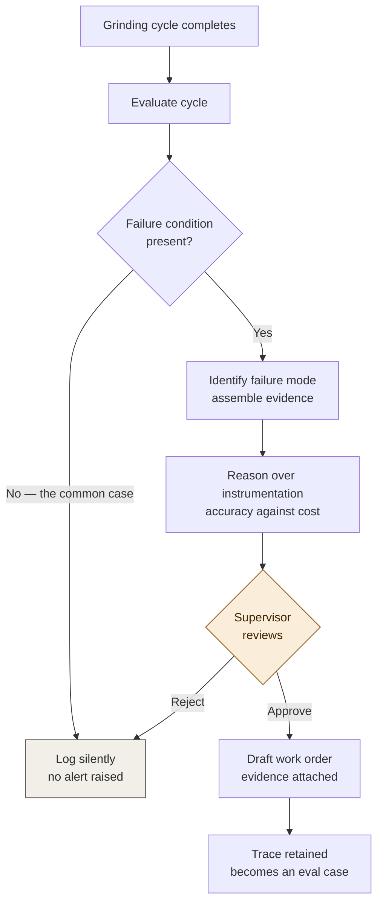
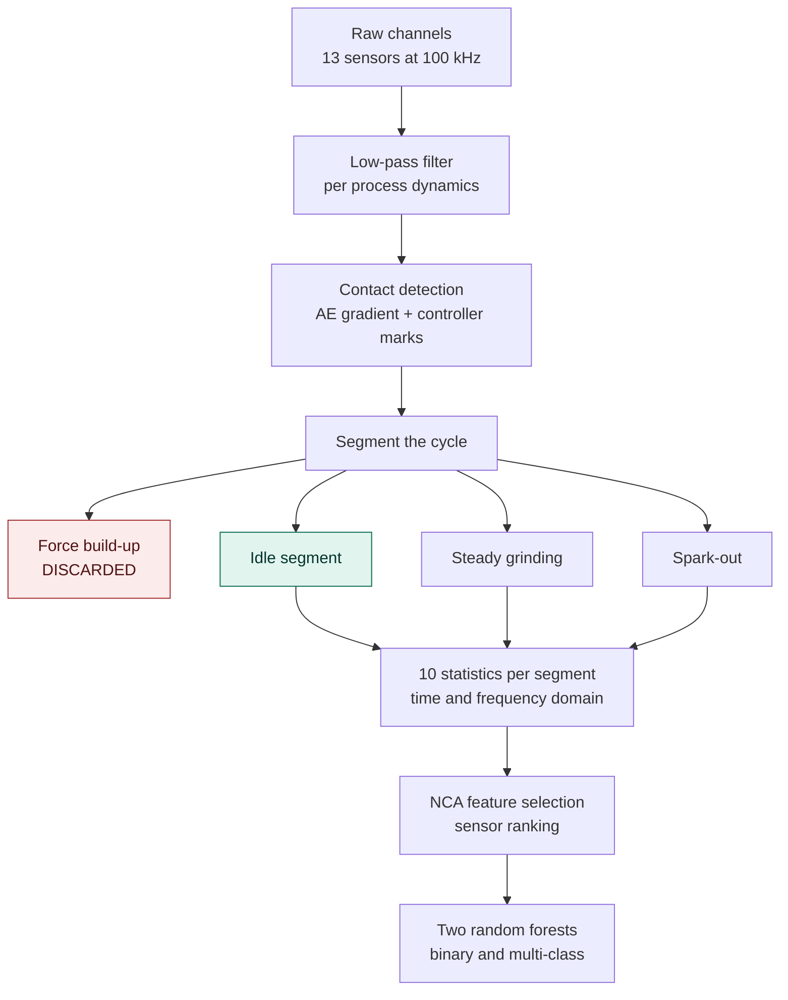
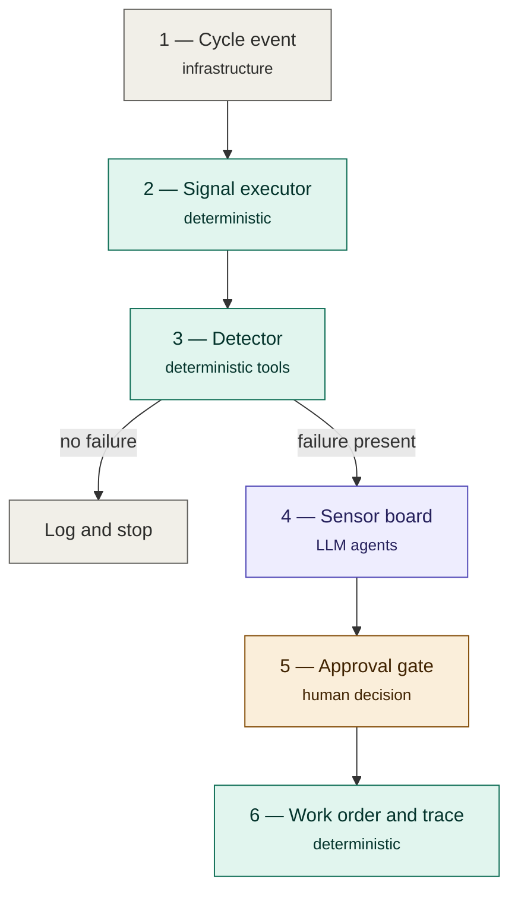
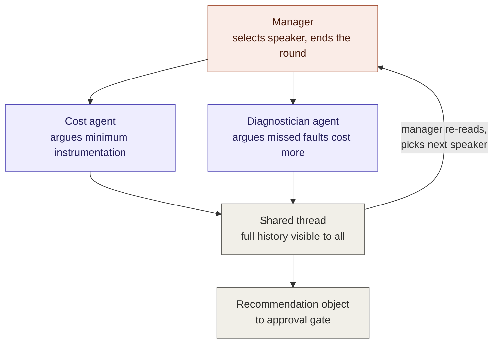
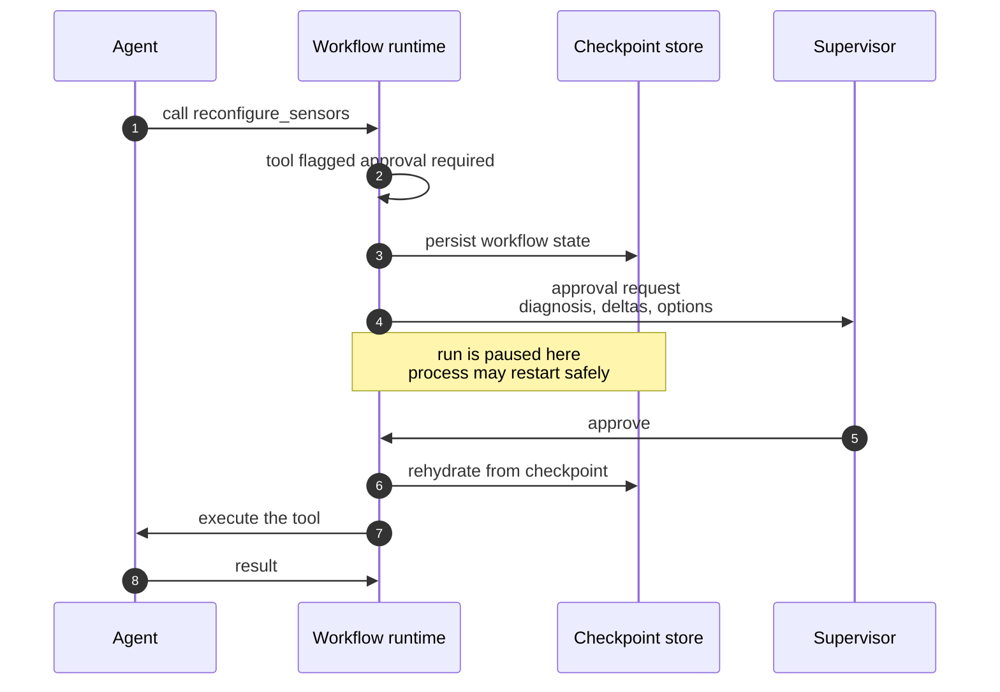

# Machine-level condition-based maintenance with agent orchestration

**A reference implementation on Microsoft Foundry and the Microsoft Agent Framework**

| | |
|---|---|
| Status | Draft for review |
| Audience | Technical program management, data science, software engineering |
| Type | Internal reference implementation / demonstrable sample project |
| Source material | Ahmer et al., *Failure mode classification for condition-based maintenance in a bearing ring grinding machine*, Int J Adv Manuf Technol 122:1479–1495 (2022), open access, CC BY 4.0 |
| Last updated | 2026-08-24 |

---

## 0. How to read this document

Sections 1–3 are the business case and are written for the TPM. Section 4 is the functional
specification and is written for everyone. Section 5 is the technical approach and splits into a
data science track (5.3–5.4) and an engineering track (5.5–5.7). Sections 6–8 cover risk,
sequencing, and the decisions we need from stakeholders before work starts.

**Diagrams.** Seven mermaid diagrams are embedded, in sections 1.3, 4.1, 5.4, 5.5, 5.6, 5.7, and 7.
They render natively in GitHub, GitLab, Azure DevOps wikis, Notion, and Obsidian. In Confluence you
will need the Mermaid macro; in Word or Google Docs they will appear as code blocks and need to be
exported as images first.

**A note on numbers.** Every accuracy figure in this document is taken from the published paper and
is reproducible. Every *financial* figure appears as a bracketed placeholder such as
`[PLACEHOLDER: cost per scrapped ring]`. These must be filled in with real plant data before this
document is shown outside the team. Do not present invented economics.

---

## 1. Business problem

### 1.1 The situation

Unplanned downtime on production machinery is one of the largest controllable costs in
manufacturing. The failure is rarely the machine stopping outright. More often a subsystem degrades
quietly, part quality drifts out of tolerance, and the problem is discovered downstream at final
inspection — after an entire production interval has been scrapped or reworked.

Grinding machines are a particularly acute case. A bearing ring grinder is a tightly coupled system:
grinding wheel, workhead spindle, drive belt, tooling, and workpiece all interact, and the machine's
physical condition directly determines the geometry of the part it produces. The source paper makes
the point that today's production grinders still struggle with process predictability precisely
because process control and machine condition are interdependent.

### 1.2 Why this hasn't been solved already

Three distinct obstacles, and they are not all technical.

**Obstacle 1 — Failure data is scarce.** Machine learning for condition monitoring is well
established in the literature. The blocker in practice is that healthy machines produce almost
entirely healthy data. You cannot train a fault classifier on faults you have never recorded. The
source paper solved this by *deliberately inducing* five real failure modes under controlled
conditions across seven experimental runs — an expensive and unusual thing for a production
organisation to do, which is exactly why the resulting dataset is valuable to us.

**Obstacle 2 — Instrumentation is a capital decision, not a modelling decision.** Every additional
sensor carries purchase cost, installation cost, cabling, calibration, and ongoing maintenance.
Multiply that across a fleet and sensor selection becomes a budget conversation rather than a
feature-importance ranking. The paper is explicit about this: it drops the workhead force sensor
despite good ranking purely because installation cost exceeded that of the alternatives, and it
states plainly that because cost, complexity, and relevance all factor in, the final sensor list
cannot be deterministic.

**Obstacle 3 — A classification is not a decision.** A model output of "class 4, 96.8% confidence"
is not actionable by a maintenance technician. Somebody has to translate that into which component
to inspect, whether to stop the line now or at shift change, whether the parts already produced need
re-measurement, and whether the spare is in stock. Today that translation is done by a small number
of experienced people, and it does not scale across a fleet.

### 1.3 The gap we are addressing

Obstacles 1 and 2 are addressed by the published research. **Obstacle 3 is the gap, and it is an
orchestration problem rather than a modelling problem.**

The existing model is already excellent — 99% accuracy on held-out data. Adding a language model to
the classification step would make it worse. The opportunity is in the layer *around* the model: the
judgment, translation, negotiation, and human coordination that currently sits in people's heads and
does not scale.



The solid path is solved and published. The dashed arrow is the gap, and it is where a small number
of experienced people currently sit.

This project builds that layer as a reference implementation, so the pattern can be evaluated and
reused rather than re-invented per machine.

---

## 2. Business goal

> **Demonstrate that multi-agent orchestration turns an accurate but inert condition-monitoring
> model into an operational decision system — one that reaches a maintenance technician as a
> justified, costed, human-approved recommendation, with a full audit trail.**

Three deliberate constraints shape this goal:

1. **We are not building a better classifier.** The random forest stays as it is.
2. **We are not automating maintenance decisions.** A human approves every consequential action.
3. **We are building a pattern, not a product.** Success is measured partly by how cleanly the
   architecture transfers to a different machine and a different model.

### 2.1 What "done" looks like

A working system that, given a single grinding cycle's sensor data:

- determines whether a failure condition is present, and if so which one;
- proposes a sensor configuration that balances diagnostic accuracy against installation cost,
  showing its reasoning;
- pauses and presents that recommendation to a human for approval;
- on approval, drafts a maintenance work order with the diagnostic evidence attached;
- emits a complete, inspectable trace of every step.

Runnable end to end in under five minutes in front of a live audience.

---

## 3. Business targets

### 3.1 Primary targets

These are what we commit to and report against.

| # | Target | Measure | Threshold |
|---|---|---|---|
| B1 | Reproduce published diagnostic accuracy | Binary and multi-class F1 on held-out test set | ≥ 99% binary, ≥ 99% multi-class |
| B2 | Detect before scrap is produced | Classification achieved using only pre-contact (idle) segment features | Yes / No |
| B3 | Quantify the cost–accuracy trade-off | Measured accuracy delta between full and reduced sensor sets | Delta computed and explainable |
| B4 | Human control over consequential actions | Proportion of state-changing actions gated by explicit human approval | 100% |
| B5 | Auditability | Proportion of runs with complete step-level trace | 100% |
| B6 | Portability | Effort to swap in a different model behind the same orchestration | ≤ 1 engineer-day, demonstrated |

**On B2** — this is the single most valuable property in the system and deserves emphasis with
non-technical stakeholders. The paper selects the *idle segment*, before the grinding wheel contacts
the workpiece, as the basis for classification. If a fault is identified there, the machine can be
stopped before the ring is cut. The system does not detect scrap; it prevents it.

**On B3** — the paper gives us verifiable ground truth. Using condition-monitoring sensors alone
(vibration on the workhead assembly and motor), binary accuracy holds at 99.3% but multi-class
accuracy falls to 96.9%, with the drive-plate setup fault being the mode most often missed. Using
process-control sensors alone (acoustic emission and force), binary accuracy is 98.6% but
multi-class drops to 90%. The combined set outperforms either. This is a real, measured, defensible
trade-off — not a hypothetical.

### 3.2 Secondary targets (measure, do not commit)

| # | Target | Measure |
|---|---|---|
| S1 | Latency | Wall-clock from cycle event to recommendation |
| S2 | Cost per run | Token and compute cost per grinding cycle evaluated |
| S3 | Recommendation quality | Human agreement rate with agent recommendations, over ≥ 20 runs |
| S4 | Reuse | Number of teams adopting the pattern within two quarters |

### 3.3 Business value model — to be completed

The value case cannot be finished without plant data. The structure is:

```
Annual value  =  (rings scrapped per fault event × [PLACEHOLDER: cost per scrapped ring])
              +  (downtime hours avoided × [PLACEHOLDER: cost per downtime hour])
              +  (diagnostic labour hours saved × [PLACEHOLDER: loaded technician rate])
              -  (sensor capital and installation, amortised)
              -  (platform and inference run cost)
```

**Action for TPM:** identify an owner for each placeholder before the value case is presented
externally. Until then this document makes a capability claim, not a financial one.

### 3.4 Explicit non-goals

- Remaining useful life prediction or prognostics. Diagnosis only.
- Automated machine shutdown or unattended actuation.
- Fleet-wide rollout, multi-machine transfer learning, or edge deployment.
- Replacing the maintenance management system.
- Improving on the published model's accuracy.

---

## 4. Functional approach

### 4.1 Operating narrative

The system as experienced by a maintenance supervisor:

1. A ring finishes grinding. Sensor data is captured automatically, as it already is today.
2. Within seconds the system evaluates the cycle. In the overwhelming majority of cases it finds
   nothing and logs the result silently. **No alert, no interruption.**
3. When a failure condition is detected, the system identifies the mode — for example, workhead
   drive belt damage — and assembles the supporting evidence.
4. The system reasons about instrumentation: given this fault type, which sensors are actually
   needed, and what would the accuracy cost be of a cheaper configuration?
5. The supervisor receives a single notification containing the diagnosis, the confidence, the
   sensor recommendation, the cost and accuracy consequences of each option, and an approve/reject
   control.
6. On approval, a work order is drafted with the diagnostic evidence attached. The supervisor
   submits it.
7. The entire exchange is retained as an inspectable trace.



Step 2 is the one to emphasise with operations stakeholders. A monitoring system that generates
alerts nobody trusts is worse than no system. Silence in the normal case is a feature.

### 4.2 Functional requirements

| ID | Requirement | Priority |
|---|---|---|
| F1 | Ingest a complete grinding cycle across all instrumented channels | Must |
| F2 | Segment the cycle into approach, roughing, and spark-out stages | Must |
| F3 | Extract time- and frequency-domain features per segment per channel | Must |
| F4 | Classify presence of a failure condition (binary) | Must |
| F5 | On positive detection, classify failure mode (multi-class) | Must |
| F6 | Terminate silently and log when no failure is present | Must |
| F7 | Produce a sensor recommendation reasoning over both accuracy and installation cost | Must |
| F8 | Present competing recommendations with their trade-offs rather than a single opaque answer | Must |
| F9 | Block all state-changing actions behind explicit human approval | Must |
| F10 | Survive process restart while awaiting approval | Must |
| F11 | Translate a failure mode into component-level guidance for a technician | Should |
| F12 | Draft (not submit) a work order with evidence attached | Should |
| F13 | Emit step-level telemetry for every run | Must |
| F14 | Convert completed runs into evaluation cases | Should |
| F15 | Express low confidence explicitly when the fault resembles no known class | Should |

**On F15** — this deserves design attention rather than being treated as an edge case. The paper
trains on five induced faults. Real machines develop faults outside that set. The two-stage design
handles this gracefully by construction: the binary detector generalises to "this does not look like
baseline" without needing to have seen the specific fault, while the multi-class model returns low
confidence across all classes. The correct system behaviour is to surface *"a failure is present and
I cannot identify it"* — which is genuinely useful — rather than to force a wrong label.

### 4.3 Personas and interfaces

| Persona | Interaction | Interface |
|---|---|---|
| Machine operator | None. System is invisible unless a fault is found. | — |
| Maintenance supervisor | Receives recommendation, approves or rejects | Approval card |
| Maintenance technician | Receives work order with diagnostic evidence | CMMS |
| Reliability engineer | Reviews traces, tunes thresholds, audits agreement rate | Observability console |
| Data scientist | Retrains and re-registers models | Model registry / tool boundary |

---

## 5. Technical approach

### 5.1 Architectural principle

> **Language models are used only where the correct answer is a judgment call. Everything else is
> ordinary, deterministic, testable code.**

This is not conservatism, it is accuracy. Signal processing and classification have correct answers
that established methods already produce at 99%. Introducing a language model there would add
latency, cost, and nondeterminism to something already right. Sensor selection under budget
constraints has *no* single correct answer — the paper says so directly — and that is where the
agent layer earns its place.

Of the six pipeline stages, two contain a language model. State this explicitly in any review; it is
the strongest argument in the design.

### 5.2 Platform

| Concern | Choice | Rationale |
|---|---|---|
| Orchestration SDK | Microsoft Agent Framework 1.0 | GA since April 2026; successor to Semantic Kernel and AutoGen; graph workflows, checkpointing, and human-in-the-loop are stable |
| Runtime | Foundry Agent Service, hosted agent | Bring our own container and framework; managed endpoint, scaling, and identity |
| Tool protocol | MCP | Model boundary stays typed and swappable |
| Observability | Foundry Control Plane, OpenTelemetry | End-to-end tracing; traces convert into evaluation datasets |
| Language | Python | Matches the data science toolchain; .NET and Go are equally supported if the team prefers |

> **Naming hazard.** Microsoft Agent Framework *Workflows* (the graph engine we are using) and
> Foundry portal *Workflows* are different things with the same name. The portal feature is being
> retired on 1 December 2026 and must not be a dependency. Flag this in onboarding; it has already
> caused confusion in this project's discussions.

### 5.3 Data approach — data science track

**Source data.** The published dataset accompanying the paper: 735 bearing rings across seven test
runs (two baseline, five induced faults), thirteen instrumented channels sampled at 100 kHz, with
process data from the controller.

**Class balance is by design, not by luck.** The experiment produces 105 rings per test run — seven
dressing intervals of fifteen rings each — after preconditioning the machine to steady state. Input
rings are pre-rough-ground to equal grinding allowance so incoming variation does not contaminate the
comparison. This is a cleaner experimental design than most industrial datasets and we should not
pretend otherwise when discussing generalisation.

**Fallback.** If the published dataset proves impractical to obtain or use, synthesise thirteen
channels with class-specific signatures matched to the paper's described physics. This is acceptable
for a reference implementation **provided it is stated on the slide and in the README**. Undisclosed
synthetic data is not acceptable.

**Split discipline.** Rings within a dressing interval share wheel condition and are not
independent. Split at the dressing-interval level, not the ring level. Random ring-level splitting
will leak and produce inflated accuracy that looks like success. This is the most likely way for
this project to quietly fail, and it should be an explicit review checkpoint.

### 5.4 Model approach — data science track

**Pipeline.**

1. Low-pass filter per channel according to process dynamics.
2. Detect wheel–workpiece contact by combining the acoustic-emission signal gradient with controller
   stage markers.
3. Segment into idle (approach), steady grinding (roughing), and spark-out.
4. **Discard the force build-up transient.** Its behaviour is dominated by incoming blank variation
   rather than machine condition — it is noise wearing the costume of signal.
5. Extract ten statistics per segment per channel across time and frequency domains: mean, standard
   deviation, skewness, kurtosis, RMS, peak-to-peak, crest factor, band power, energy, and 90th
   percentile.
6. Select features by neighbourhood component analysis; rank sensors from feature frequency and
   position in the top-100 list.
7. Train two random forests — binary and multi-class — via bootstrap aggregation, 30 learning
   cycles, decision-tree base learners.



The discarded branch and the highlighted branch are both deliberate. The force build-up transient is
dominated by incoming blank variation rather than machine condition. The idle segment is the one
that delivers target B2 — classification before the wheel touches the part.

**Reproduction targets.** Binary F1 99.54%; multi-class global F1 99.68%; degraded configurations as
listed in section 3.1. If we cannot reproduce these, that is a finding worth reporting, not a
failure to hide.

**Explicitly out of scope:** hyperparameter tuning, alternative architectures, deep learning. The
paper does not tune, and matching its baseline is the point.

### 5.5 Orchestration design — engineering track

Six stages. Deterministic executors in plain code; agents only where marked.



Green is ordinary code. Purple is the only stage containing a language model. Amber is the human.
Two of six stages involve an LLM, and nothing irreversible happens without the amber box.

| Stage | Type | Contents |
|---|---|---|
| 1. Cycle event | Infrastructure | Controller signals completion, traces land in storage, event reaches hosted agent endpoint, run starts with isolated state |
| 2. Signal executor | Deterministic | Filtering, contact detection, segmentation, feature extraction |
| 3. Detector | Deterministic tools | Binary classifier; branch to silent termination or escalate to multi-class |
| 4. Sensor board | **Agents** | Group chat orchestration — see 5.6 |
| 5. Approval gate | Human-in-the-loop | Approval-required tool, pause, checkpoint, resume |
| 6. Work order and trace | Deterministic | Draft work order, emit spans, contribute evaluation case |

### 5.6 The agent layer — engineering track

Stage 4 uses **group chat orchestration**: several agents contribute to a shared conversation thread
while a manager decides who speaks next and when the discussion ends. The topology is a star, with
the manager at the centre. The pattern is also called roundtable or multi-agent debate — prefer those
names with non-developer audiences, since "group chat" implies a messaging product.

**Participants.**

- *Cost agent* — argues for the minimum viable instrumentation; grounded in sensor BOM and
  installation effort.
- *Diagnostician agent* — argues from diagnostic consequence; grounded in maintenance history and
  the measured accuracy deltas.
- *Manager* — round-robin selection, capped iterations, terminates and summarises.



Shared context is the reason this is a group chat rather than two independent calls: the
diagnostician must be able to respond to the cost agent's *specific* proposal.

**Mandatory:** set a maximum iteration count. An uncapped group chat with a manager that never
terminates is a well-documented way to consume a large budget quickly.

**Design note.** The value of this stage is not that agents produce a better answer than a
constrained optimiser would. It is that they produce a *legible* one — a supervisor can read the
disagreement and understand what they are trading away. Optimise the design for legibility.

### 5.7 Human-in-the-loop — engineering track

Any tool that changes state is marked as requiring approval. When an agent calls it, the workflow
emits an approval request, pauses, and checkpoints. Nothing executes until a human responds.



Step 5 is the demo moment: kill the process while paused, restart it, and the run continues from
where it stopped.

Two implementation hazards, both of which have bitten other teams:

**Checkpoint identity.** Agent identifiers must be stable and reused when the workflow is
reconstructed. Changing an agent's name or id makes the rebuilt workflow incompatible with its
existing checkpoint. Generating ids at startup will break resume in a way that looks like a
framework bug. Hardcode them.

**The approval payload is the product surface.** "Agent wants to call `reconfigure_sensors`" is
useless to a supervisor. The payload must carry the diagnosis, confidence, the accuracy delta, the
cost delta, and which failure mode goes undetected under the cheaper option. Design this object
*before* writing agent prompts.

### 5.8 Interfaces and contracts

| Boundary | Contract | Owner |
|---|---|---|
| Storage → signal executor | Raw cycle blob, per-channel schema | Engineering |
| Signal executor → detector | Typed feature vector | Shared |
| Detector tools | MCP tool schema; model artefacts versioned in registry | Data science |
| Agents → approval gate | Recommendation object, per 5.7 | Shared |
| Approval gate → CMMS | Draft work order payload | Engineering |
| All stages → telemetry | OpenTelemetry spans | Engineering |

The MCP boundary is what delivers target B6. Behind it, data science can retrain and re-register
without touching orchestration code.

---

## 6. Risks and mitigations

| Risk | Impact | Likelihood | Mitigation |
|---|---|---|---|
| Data leakage across dressing intervals inflates accuracy | High | **High** | Interval-level splitting; explicit review checkpoint before any accuracy is reported |
| Published dataset unobtainable or unusable | Medium | Medium | Synthetic fallback, clearly disclosed |
| Group chat produces verbose, unhelpful debate | Medium | Medium | Iteration cap; structured output schema; evaluate S3 agreement rate |
| Agent cost per run exceeds value per run | Medium | Low | Agents run only after positive detection; measure S2 from day one |
| Audience reads the demo as production-ready fleet capability | **High** | **High** | Section 3.4 stated verbally at every showing; see 6.1 |
| Confusion between MAF Workflows and retiring portal Workflows | Low | Medium | Called out in onboarding and in 5.2 |
| Scope drift into prognostics or autonomous action | Medium | Medium | TPM holds section 3.4 |

### 6.1 The generalisation caveat — say this out loud

Seven controlled runs, one machine, deliberately induced faults, pre-conditioned input material. The
agent layer makes the *pipeline* portable across machines. It does not make the *model* generalise
to a different grinder, a different bearing type, or a fault mode that was not induced.

Say this before someone in the audience says it for you. Volunteering the limitation is what makes
the rest of the claim credible.

---

## 7. Sequencing

Estimated one engineering week plus data science support. Sequenced so that each phase produces
something demonstrable.

| Phase | Duration | Output | Primary owner |
|---|---|---|---|
| 0. Data acquisition and split design | 1–2 days | Dataset in hand, interval-level split agreed | Data science |
| 1. Model reproduction | 1–2 days | Two random forests matching published F1 | Data science |
| 2. Tool wrapping | 0.5 day | Models behind MCP; typed contracts | Shared |
| 3. Local workflow graph | 1 day | Deterministic stages 1–3 and 6 running locally | Engineering |
| 4. Agent layer | 1 day | Group chat producing structured recommendation | Engineering |
| 5. Approval and durability | 0.5 day | Kill-and-resume demonstrated | Engineering |
| 6. Foundry deployment | 1 day | Hosted agent, tracing live | Engineering |
| 7. Evaluation loop | 0.5 day | Eval set built from traces | Shared |
| 8. Demo rehearsal | 0.5 day | Five-minute run, timed | TPM |

```mermaid
flowchart LR
    P0["0 — Data<br/>and split"] --> P1["1 — Model<br/>reproduction"]
    P1 --> G{{"GATE<br/>split methodology<br/>reviewed"}}
    G --> P2["2 — Tool<br/>wrapping"]
    P2 --> P3["3 — Local<br/>workflow"]
    P3 --> P4["4 — Agent<br/>layer"]
    P4 --> P5["5 — Approval<br/>and durability"]
    P5 --> P6["6 — Foundry<br/>deployment"]
    P6 --> P7["7 — Eval<br/>loop"]
    P7 --> P8["8 — Demo<br/>rehearsal"]

    classDef ds fill:#E6F1FB,stroke:#185FA5,color:#042C53
    classDef eng fill:#E1F5EE,stroke:#0F6E56,color:#04342C
    classDef gate fill:#FCEBEB,stroke:#A32D2D,color:#501313
    class P0,P1 ds
    class P2,P3,P4,P5,P6,P7,P8 eng
    class G gate
```



**Gate between phases 1 and 2:** do not proceed until the split methodology has been reviewed. Every
downstream number depends on it.

### 7.1 Demo narrative

Roughly four minutes, and the arc matters more than the feature coverage:

1. A cycle arrives; failure detected. *(Fast. No commentary. Ten seconds.)*
2. Constraint injected: budget covers condition-monitoring sensors only, drop acoustic emission.
3. Rerun. Binary holds at 99.3%; multi-class falls to 96.9%; drive-plate faults are what get missed.
4. Cost agent and diagnostician disagree in the shared thread. The disagreement is the product.
5. Human approves reinstating the acoustic emission sensor. Accuracy recovers.
6. Kill the process mid-pause. Restart. It resumes. *(Thirty seconds, high credibility yield.)*
7. Work order drafted; trace shown; trace becomes an evaluation case.

Spend the time on steps 4 through 6. Steps 1 through 3 are table stakes and the audience has seen
dashboards before.

---

## 8. Open decisions

Required from stakeholders before or during phase 0.

| # | Decision | Needed from | By |
|---|---|---|---|
| D1 | Owners for each financial placeholder in 3.3 | TPM / operations | Phase 0 |
| D2 | Confirm published dataset is obtainable, or authorise synthetic fallback | Data science | Phase 0 |
| D3 | Target CMMS for the work-order draft, or accept a stub | Engineering / operations | Phase 3 |
| D4 | Who plays the approving supervisor in the demo | TPM | Phase 8 |
| D5 | Internal-only or customer-facing; changes the caveat language throughout | TPM | Before phase 8 |
| D6 | Python or .NET as the reference language | Engineering | Phase 0 |

---

## Appendix A — Reference figures from the source paper

All reproducible; use these as acceptance criteria.

| Configuration | Binary accuracy | Multi-class accuracy |
|---|---|---|
| Selected sensor set (58 features) | 99.54% F1 | 99.68% global F1 |
| Condition-monitoring sensors only | 99.3% | 96.9% |
| Process-control sensors only | 98.6% | 90% |

Model benchmark, training accuracy: random forest 99.8; support vector machine 96.6; decision tree
93.1; k-nearest neighbour 91.4.

Failure modes: baseline (reference); workhead drive belt damage; workhead spindle unbalance
(2.5G, outside grinding-spindle specification per ISO 1940-1); drive plate setup; workhead tooling
setup; worn workhead tooling support.

## Appendix B — Glossary

| Term | Meaning |
|---|---|
| CBM | Condition-based maintenance — act on observed condition rather than a fixed schedule |
| Dressing interval | Rings ground between two grinding-wheel dressing operations; fifteen in this experiment |
| Spark-out | Final cycle stage where the slide stops advancing and the surface finish forms |
| Group chat orchestration | Multi-agent pattern with a shared thread and a manager selecting speakers |
| Hosted agent | Agent code deployed as a container with a managed endpoint, scaling, and identity |
| MCP | Model Context Protocol — the typed tool boundary between agents and functions |
| MAF | Microsoft Agent Framework |
| Checkpoint | Serialised workflow state allowing pause and resume across process restarts |

## Appendix C — Source

Ahmer M., Sandin F., Marklund P., Gustafsson M., Berglund K. (2022). *Failure mode classification
for condition-based maintenance in a bearing ring grinding machine.* The International Journal of
Advanced Manufacturing Technology 122:1479–1495. https://doi.org/10.1007/s00170-022-09930-6

Open access under CC BY 4.0. Attribution required in any derived material, including slides.
